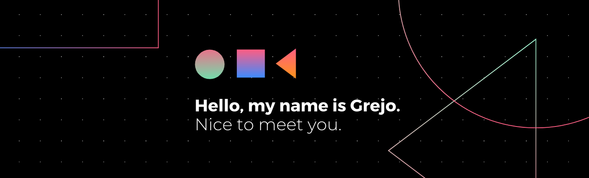

<!--  -->
<h1 align="center">Hi Fellow Coder , I'm Grejo</h1>
<h3 align="center">Exuberant, Intuitive, Practically Inventive and Problem Solver.</h3>
<br>

## ⚡ Technologies

**Talk to me about:**

HTML / CSS / JavaScript / Bootstrap / C / C++ / Python / Django / Flask / Git / GitHub / MongoDB / MySQL / Shared Web Hosting / Domain,DNS / Cloudflare / Digital Ocean / AWS / Firebase / ReactJS / React Native / Flutter / Unity Game Engine 

<p align=center style="margin-top: 20px;margin-bottom: 10px">
  <a href="https://github.com/grejojoby">
    
  </a>
 
  <a href="https://github.com/grejojoby?tab=repositories">
    
    <a href="https://github.com/grejojoby"></a>
  </a>
</p>

<hr>
<p>📫 Reach out to me at <a href="https://grejo.in" target="_blank">grejo.in</a></p>
<p align="center" style="margin-top: 20px;margin-bottom: 30px"><a href="https://twitter.com/grejo00"></a> <a href="https://www.linkedin.com/in/grejojoby"></a> <a href="https://www.instagram.com/grejojoby/"></a> 
</p>

<!--START_SECTION:waka-->

```text
HTML         10 hrs 59 mins  █████████████████▒░░░░░░░   69.75 %
TypeScript   2 hrs 17 mins   ███▓░░░░░░░░░░░░░░░░░░░░░   14.50 %
CSS          1 hr 43 mins    ██▓░░░░░░░░░░░░░░░░░░░░░░   10.95 %
Python       17 mins         ▒░░░░░░░░░░░░░░░░░░░░░░░░   01.90 %
JavaScript   12 mins         ▒░░░░░░░░░░░░░░░░░░░░░░░░   01.29 %
JSON         12 mins         ▒░░░░░░░░░░░░░░░░░░░░░░░░   01.28 %
```

<!--END_SECTION:waka-->


<!-- <p align="center" style="display: flex;justify-content: space-around;">
  
</p>
<hr>
 -->
